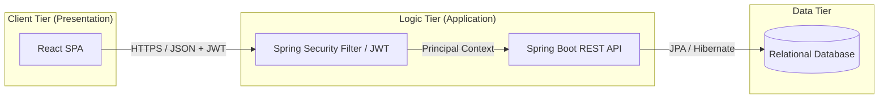
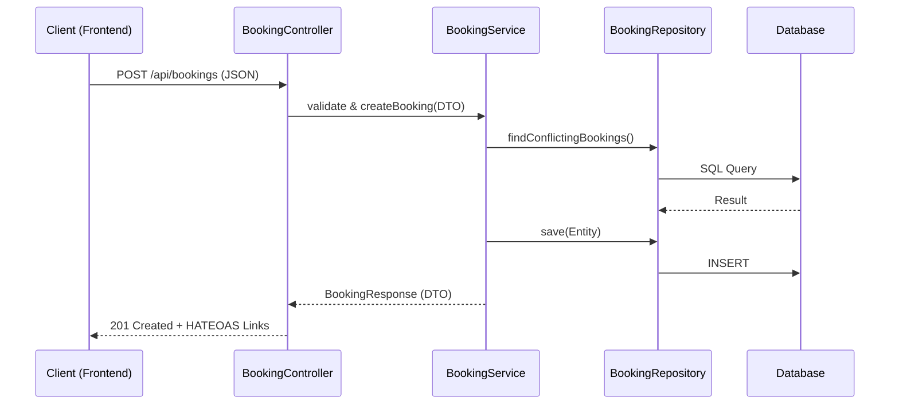
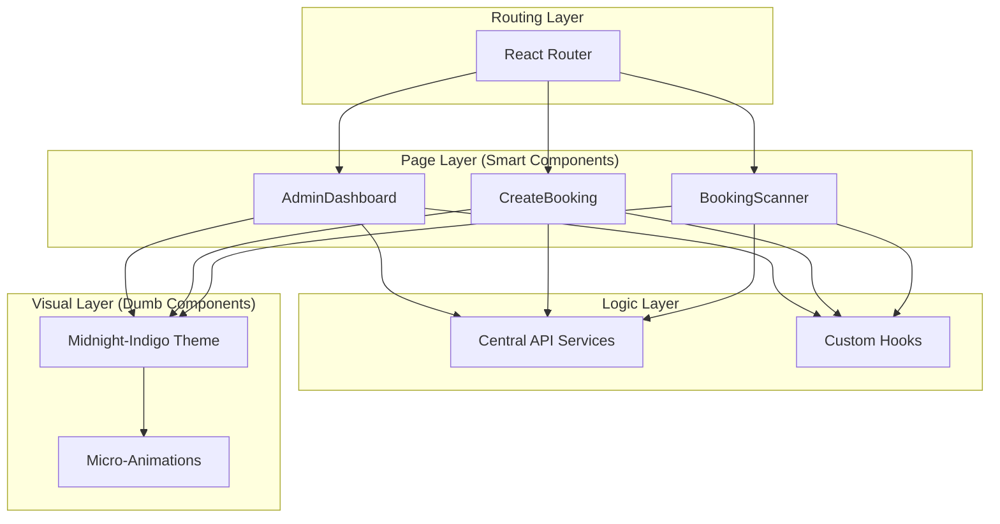

# Architecture Design Specification - CampusNexus

This document details the architectural patterns and structural design of the CampusNexus Booking System.

---

## 1. Overall System Architecture
CampusNexus follows a **Decoupled 3-Tier Architecture**, ensuring that the frontend and backend can evolve independently.

**Key Architectural Decisions:**
- **Statelessness:** The server does not store session data. Every request is verified via a JWT token in the header.
- **Cross-Origin Resource Sharing (CORS):** Managed via backend configuration to allow the React frontend (Port 5173/3000) to communicate with the API (Port 8081).

---

## 2. REST API Architecture (Backend)
The backend implementation follows the **N-Tier Layered Pattern**, strictly separating the transport protocol (HTTP) from the business logic.

**Architecture Components:**
- **Data Transfer Objects (DTO):** Prevents internal database entities from being exposed directly to the client.
- **HATEOAS Provider:** Injected into Controllers to provide hypermedia links (`self`, `cancel`, `approve`), making the API self-discoverable.
- **Global Exception Handler:** A centralized `@ControllerAdvice` that converts backend exceptions into standard RFC 7807 problem details.

---

## 3. Front-End Architecture (Frontend)
The frontend utilizes a **Component-Service Architecture** built on React, emphasizing reusability and theme consistency.

**Key Architectural Decisions:**
- **Modular Services:** All API interaction logic is abstracted into `services/` files, keeping components UI-focused.
- **CSS Variable System:** The "Midnight-Indigo" theme is implemented using CSS variables (Design Tokens) for easy global updates.
- **Conditional Rendering:** Used to manage complex states such as QR Scanning vs. Manual Review in the Admin module.
